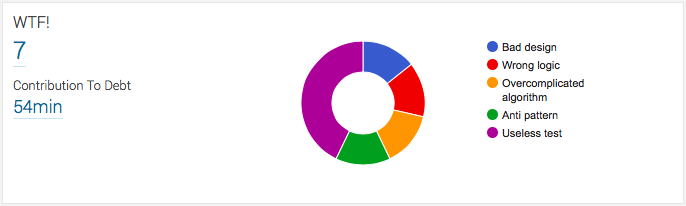

# WTF! plugin for SonarQube
The WTF! plugin for [SonarQube](http://www.sonarqube.org/) allows developers to report issues usually not seen by SonarQube but which should be taken into consideration when evaluating a project's technical debt. 

## Rationale

The great thing about SonarQube is that it reports in an objective and non disputable way issues based on a predefined set of rules or checks that need to be activated. Depending on the rules SonarQube administrators activate, reported issues will differ and so will reported technical debt.

While this is a (really) great way to report coding issues, my experience showed that it is not perfect due to two main reasons. 

1. SonarQube only reports issues and technical debt for the rules that have been activated. In other words, deactivate all rules and you'll obtain a project with a "A" SQALE rating and zero issues. 

2. Even if you do a great (and honest) job in selecting the rules to be activated, SonarQube is "only" a tool that does what it is told to do: it applies those rules. If the rules are not precise enough or not smart enough you'll end up with a project that shines in SonarQube (i.e. great rating, no issues, high coverage, good documentation, nothing to worry about) but if you scratch the surface a bit and ask a human to review it, you may have another feedback, far from being "shiny". Something that may sound like "WTF!" 

Thom Holwerda [posted a great comic strip](http://www.osnews.com/story/19266/WTFs_m) a few years ago stating that the only valid measurement of code quality is the WTF count per minute. While being humoristic, this observation is really realistic. If you've heard a team member say "WTF!" in your open space, I'm pretty sure you understand what I'm talking about.

This comic strip and the underlying question of how to improve code quality was discussed in Robert C. Martin's ["Clean Code"](http://www.amazon.com/gp/product/0132350882) book as well as in this [interesting blog post](http://www.gridshore.nl/2008/03/29/how-wtfs-improve-code-quality-awareness/). Here is a excerpt from this blog post:

> A WTF is typically raised when a developer more or less accidentally opens a class file and sees something that just doesn’t seem right. It doesn’t have to be a formal review.

> Getting code quality up after a WTF has been raised is easy. Just let the developer who found the WTF fix the code in such a way, that the WTF doesn’t apply to that code any more. However, the developer causing the bad code will not know, and continue with his habits.

This is what motivated the creation of the WTF! plugin. It has three major objectives :

1. Give voice to developers to unhide hidden code smells that cannot be usually detected with SonarQube and share them with the development team,

2. Let developers provide useful information such as an evaluation of the remediation cost, the "WTF!" category that has been detected, a message that will appear directly in SonarQube and aims at making those "WTF!" contribute to the overall technical debt reported by SonarQube,

3. Let development teams access easily detected "WTF!" issues to be able to use this information during sprint plannings and code reviews.

Yes, we want to make WTF! visible and *force* team members to discuss them and fix them.

## How does it work ?

The plugin is made of two parts:

1. A Java annotation named... `@WTF` that has a source retention that has to be used to report bad practices.

2. A SonarQube plugin that provides a single rule that analyzes both source code and test code and searches for `@WTF` annotations. 

## Usage

### Requirements

* SonarQube 4.5.4+
* SonarQube's [Java plugin](http://docs.sonarqube.org/display/PLUG/Java+Plugin) version 3.5+ 

### Plugin installation

The plugin can be [downloaded from GitHub releases](https://github.com/QualInsight/qualinsight-plugins-sonarqube-smell/releases).

After having placed the plugin's jar in `{SONARQUBE_INSTALL_DIRECTORY}/extensions/plugins` you need to restart your SonarQube instance.

You have then to add the "WTF! Measures" widget to your project or view dashboard.

The last installation step, if you want to have WTF! annotations to contribute to the project's technical debt, is to add to your profile the rule named "WTF!" Its key is "`qualinsight-wtf:W0001`".

That's it!

_Note 1:_ While I recommend activating the WTF! rule, you don't have to do it. If the rule is not activated, the plugin will still report WTF! related technical debt in its own widget, but WTF annotations will not be counted as issues, and as such they will not contribute to the project's technical debt, nor impact the SQALE rating. Do this if you don't want to mix automated debt discovery with "subjective" debt declaration.  

_Note 2:_ Unfortunately SonarSource [refused to add the plugin to SonarQube's update center](https://groups.google.com/d/msg/sonarqube/d8vQyKxqPZk/fa2csHAVDwAJ) due to the fact that they consider the name of the plugin as being inappropriate for corporate users.

### Adding WTF! to your code

Next step is to add WTF! to your code. This section explains how to do it.

#### Maven dependency addition

In order to be able to use the `@WTF` annotation, the following dependency must be added to your pom.xml file :

```
<dependency>
    <groupId>com.qualinsight.plugins.sonarqube</groupId>
    <artifactId>qualinsight-plugins-sonarqube-wtf-api</artifactId>
    <version>1.0.4</version>
</dependency>
```

_Note_: The dependency is available in Maven central repository.

#### Annotating code

The `@WTF` annotation can be placed on Java packages, types, methods, constructors, fields, parameters, local variables.

For instance :

```
@WTF(minutes=10,reason="This class should be redesigned in order to ...", type=WTFType.BAD_DESIGN)
public class MyClass {
    ...
}
```

It takes three mandatory parameters :

| Parameter | Type     | Mandatory   | Example                                           |
|-----------|----------|-------------|---------------------------------------------------|
| minutes   | int      | yes         | 10                                                |
| reason    | String   | yes         | This class should be redesigned in order to...    |
| type      | WTFType  | yes         | WTFType.BAD_DESIGN                                |

Multiple WTFs can be declared using the `@WTFs` annotation as follows:

```
@WTFs({
    @WTF(minutes=20,reason="This class should be redesigned in order to ...", type=WTFType.BAD_DESIGN),
    @WTF(minutes=5,reason="This class should be renamed in order to highlight its responsibility", type=WTFType.UNCOMMUNICATIVE_NAME)
})
public class MyClass {
    ...
}
```


#### Available WTF Types

The WTFType enum currently can take the following values (greatly inspired by Coding Horrors' [code smells](http://blog.codinghorror.com/code-smells/) and Industrial Logic's [smells to refactorings](http://www.industriallogic.com/wp-content/uploads/2005/09/smellstorefactorings.pdf)) :

| WTFType                    | When should I use it ?                                                     |
|----------------------------|----------------------------------------------------------------------------|
| ABBREVIATIONS_USAGE        | Confusing abbreviations are being used instead of explicit names           |
| ANTI_PATTERN               | An anti-pattern has been used.                                             |
| BAD_DESIGN                 | The design is really bad and should be improved.                           |
| BAD_FRAMEWORK_USAGE        | A framework is not used the way it should                                  |
| BAD_LOGGING                | The logging message, level, is inappropriate or the log is redundant.      |
| HOW_COMMENT                | The comment or documentation focuses on the "how" instead of the "what"    |
| INDECENT_EXPOSURE          | The class unnecessarily exposes its internals.                             |
| MEANINGLESS_COMMENT        | The comment or documentation text is meaningless.                          |
| MIDDLE_MAN                 | The class delegates all its work, is it really needed ?                    |
| MISSING_IMPLEMENTATION     | A method's implementation is missing.                                      |
| MULTIPLE_RESPONSIBILITIES  | The class or method has multiple responsibilities.                         |
| NON_EXCEPTION              | The exceptions mechanism is used for non exceptional cases.                |
| ODDBALL_SOLUTION           | The problem is solved in multiple ways throughout the system.              |
| OVERCOMPLICATED_ALGORITHM  | There is a way to simplify an algorithm.                                   |
| PRIMITIVES_OBSESSION       | The code relies too much on primitives instead of classes.                 |
| REFUSED_BEQUEST            | The class extends another class but does not use its methods.              |
| REINVENTED_WHEEL           | A library does the same job, probably better                               |
| SOLUTION_SPRAWL            | It takes too many classes to do anything useful.                           |
| SPECULATIVE_GENERALITY     | The code is written thinking about tomorrow's problems.                    |
| UNCOMMUNICATIVE_NAME       | The name does not communicate the purpose of the class, field, method.     |
| USELESS_TEST               | The test is useless (it tests nothing)                                     |
| WRONG_LANGUAGE             | Wrong language (french, english, german...) is being used                  |
| WRONG_LOGIC                | Wrong (business) logic is being used.                                      |

Feel free to ask for new values!

## Example results

The first screenshot depicts the WTF! widget in action. It shows how many WTF! have been reported, their contribution to technical debt as well a distribution among possible WTF! issue types. 



The second screenshot shows that WTF! issues are added to regular SonarQube issues count. In this example the only activated rule is the WTF! one. Therefore, the technical debt is equal to the one reported on previous screenshot. If we hadn't activated the rule (see _installation_ section) the plugin wouldn't had contributed to the debt.


## Conclusion

I hope you'll enjoy this small plugin as much as I enjoyed writing it ! Do not hesitate to request new WTF types and send comments as well as requests for improvement.

Cheers !

## Links

* [WTF! Java API](http://api.sonarqube.wtf) on Maven central
* [WTF! SonarQube plugin](http://plugin.sonarqube.wtf) on Maven central
* [WTF! Releases](http://releases.sonarqube.wtf) on GitHub

## Build status


